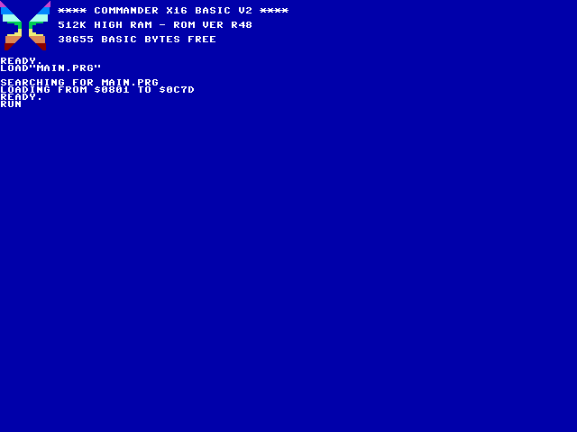
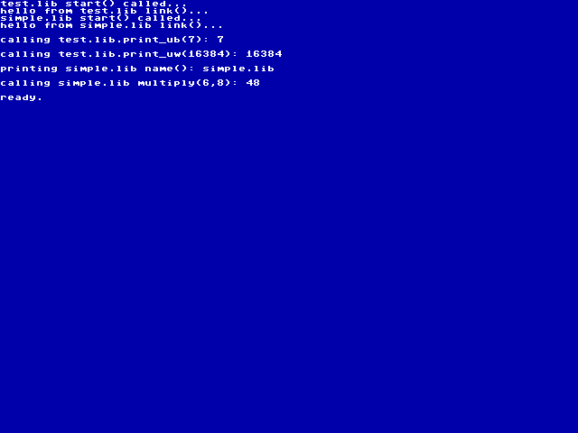

# Relocatable libraries / objects

This demonstrates a simple technique from [C64 OS](https://c64os.com/post/relocatable_6502) for creating small relocatable binaries (or "libraries") for 6502 processors.

This implementation is in Prog8 for the Commander X16.

## Running the demo

First you need to run `make` (Linux/macOS) or `make -f Makefile.win` on Windows.
Then you can run `make emu` or `make -f Makefile.win emu` to launch the emulator using the Host FS.  From there you run `LOAD "MAIN.PRG"` and `RUN` like a normal program.

Here is a screenshot of loading / running: 

Here is the output of the sample program: 
